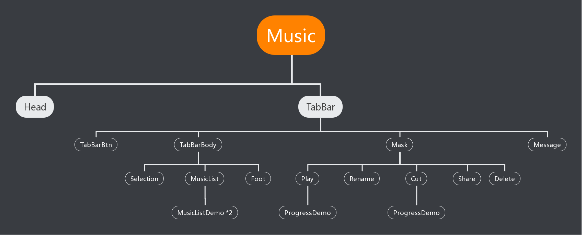
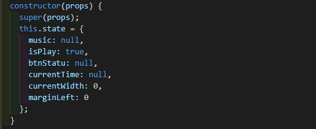

# 结营作业(二)

1、store：
* 接口中拉取的数据(扁平化后)
* selectedMusicIds[]：存储当前选中的音乐

2、reducer拆分：
* 本次作业中，并没有拆分reducer。
* 因为store中并不存储UI相关数据，reducer并不控制UI，reducer处理的action类型相同且量不大。
* action也没拆

3、组件结构

* 除了Head都可以看作是TabBar的子组件
* Message：消息提示组件，在Cut、Foot、MusicList部分都有用到
* Selection：单选和多选组件
* ProgressDemo组件：Cut组件和Play组件中的进度条部分复用ProgressDemo
* MusicListDemo组件：在MusicList组件中调用两次，分别传入我的音乐和推荐音乐相关信息

4、TabBar组件
* state：

* 方法：修改以上属性的方法
* 将这些属性和方法传给子组件，控制页面渲染。某个子组件修改数据后，兄弟组件也会同步

5、Cut组件
* Cut组件需要知道ProgressDemo组件的audio的当前时间
* 调用ProgressDemo组件，传入bmt、emt、以及获取audio当前时间的回调函数。

6、ProgressDemo组件
* state:

4、问题
* Message组件的显示or隐藏问题
* 进度条标记起点和清除标记时有一点点的延时
