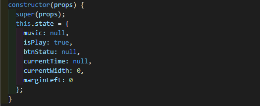

# 小年糕前端训练营--总结

## HTML&CSS
1、定位

2、盒模型

3、flex

4、动画
* animation
* transition

5、居中对齐

## 初识JavaScript
1、Josn：一种数据结构，{} [] 的集合

2、Object：

* 取值：student.id、student[id]
* 遍历：Object.Keys()、Object.entries()

3、Array
* Array.map()、Array.forEach()
* Array.splice(index,howmany, item1,item2,…)
* Array.push()、Array.pop()、Array.unshift()、Array.shift()

4、function定义
* function
* =>

5、class
* 属性、方法
* dog1 = new Dog('dog1');
* super()

## react

1、npm创建react项目

2、所见即所得、数据驱动页面渲染

4、state：管理内部数据

5、props：传输数据的介质(水管)

6、组件生命周期：
* componentWillMount
* componentDidMount

7、...{}、...[]

8、组件拆分：
* 自治、解耦（高内聚、低耦合）
* 复用：抽出共有部分复用
* 数据同时被两个组件调用，提升数据层级

## redux

1、mapDispatchToProps(dispatch)

2、mapStateToProps(state)

3、bindActionCreators(actions, dispatch)

4、connect(mapStateToProps, mapDispatchToProps)(className)

## 中间件
1、 axios
* axios.post().then().catch()
* 两种请求：GET、POST
* 三个参数 method、url、params

2、store => next => action => {}

3、new Promise((resolve, reject) => {}).then(() => {}).catch(() => {})

## 路由
1、配置路由：
* 两种方式：routes、标签

2、路由跳转：
* Link
* browserHistory.push()
* router.push()

3、url传参
* 配置路由： path/：mid、path-:mid
* 取参数：this.props.params.mid

## 数据扁平化

1、 为什么？ 

* 数据多层嵌套

* 查、改方便，便于维护

2、 normalize、 Schema

3、 扁平化规则：
* new Schema.Entity(' ', { }, { });
* 扁平化的规则对应接口数据

# 结营作业(一)

1、数据结构：
* 两个4*4的数组：
* gameGrid[]：存放当前各位置的值
* flag[]：存放本次操作中各位置状态：刚出现？合并？
* 其他...

2、组件结构：
* gameArea：4*4
* scoreArea：得分区
* EndArea：包括失败和成功

3、思路：
* 四个方向操作可看成一样，先完成向左移动。
* 向左移动过程中，先将一行中非零元素左移，再将相邻且相等的元素合并。
* 其余三个方向可以通过数组转置，转变为向左移动。

4、CSS
* 动画：加分，方格元素出现、合并
* 适配：通过flex布局实现内部标签大小自动调节

5、redux-persist
* 引入redux-persist存储历史数据，eg:历史最高分bestScore

# 结营作业(二)

1、store：
* 接口中拉取的数据(扁平化后)
* selectedMusicIds[]：存储当前选中的音乐

2、reducer拆分：
* 本次作业中，并没有拆分reducer。
* 因为store中并不存储UI相关数据，reducer并不控制UI，reducer处理的action类型相同且量不大。
* action也没拆

3、组件结构

* 除了Head都可以看作是TabBar的子组件
* Message：消息提示组件，在Cut、Foot、MusicList部分都有用到
* Selection：单选和多选组件
* ProgressDemo组件：Cut组件和Play组件中的进度条部分复用ProgressDemo
* MusicListDemo组件：在MusicList组件中调用两次，分别传入我的音乐和推荐音乐相关信息

4、TabBar组件
* state：

* 方法：修改以上属性的方法
* 将这些属性和方法传给子组件，控制页面渲染。某个子组件修改数据后，兄弟组件也会同步

5、Cut组件
* Cut组件需要知道ProgressDemo组件的audio的当前时间
* 调用ProgressDemo组件，传入bmt、emt、以及获取audio当前时间的回调函数。

6、ProgressDemo组件
* state:

* currentTime记录当前播放进度，结合props的bmt和emt，调整进度条宽度和歌曲进度。
* currentWidth、marginLeft控制进度条的样式，由currentTime计算得到，或由点击、拖动的位置计算得到。
* onTouch。拖动开始，暂停播放。拖动过程中不改变音乐播放进度，只改变进度条宽度。拖动结束，修改音乐播放进度，开始播放。
* 拖动过程中，计算起点的宽度要根据currentTime来算，不能根据currentWidth计算。

7、login中间件
* 作用：过滤action
* 位置：serverApi之前
* 将有Token这个参数，但还没有赋值的action拦截下来，存入一个数组。Object.keys(params).includes('token') && !params.token。
* 给拉去个人信息的action中增加一个回调函数，next到serverApi。拉到信心后执行回调函数，login就得到了Token。
* 将得到的Token赋给被拦截的action中，next。

4、问题
* Message组件的显示or隐藏问题
* 进度条标记起点和清除标记时有一点点的延时
